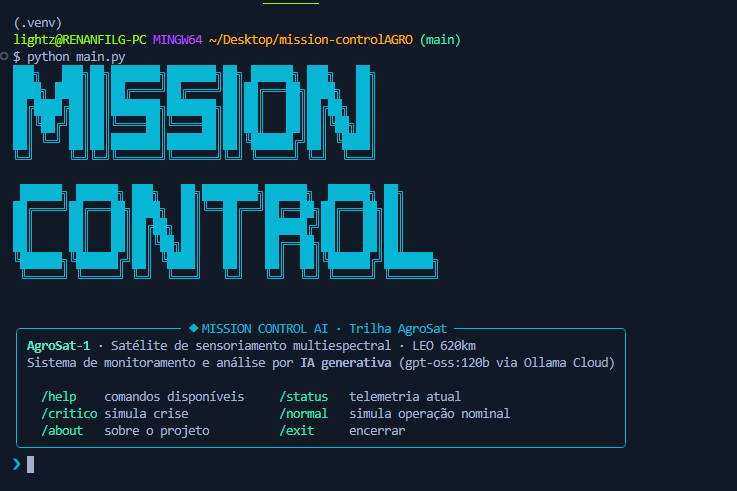
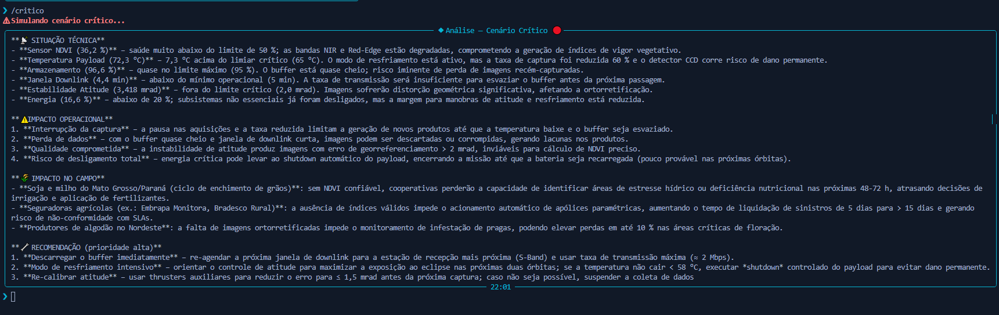

# Mission Control AI — AgroSat

**Global Solution 2026.1 · FIAP · Ciência da Computação**
Disciplina: Prompt Engineering and Artificial Intelligence

Sistema de monitoramento operacional de satélite de sensoriamento agrícola com análise em linguagem natural por IA generativa (Ollama Cloud · gpt-oss:120b).

---

## Integrantes

| Nome | RM | Turma |
|------|----|-------|
| Rodger Costa | RM000000 | 1CCPF |

Modalidade: **Individual**

---

## O que o projeto faz

O **Mission Control AI — AgroSat** monitora em tempo real os parâmetros de telemetria do satélite **AgroSat-1** (sensor multiespectral LEO ~620km) e usa IA generativa para transformar dados orbitais em análises compreensíveis — sempre conectando cada anomalia técnica ao seu impacto concreto no agronegócio brasileiro.

O sistema:
1. Simula 7 parâmetros de telemetria do satélite (NDVI, temperatura, energia, armazenamento, downlink, atitude, sinal)
2. Aplica lógica Python de alertas e decisão automática para situações críticas
3. Injeta os dados dinamicamente num prompt rico e chama o LLM via Ollama Cloud
4. Exibe respostas em linguagem natural pela CLI, sempre com três camadas: situação técnica → impacto operacional → impacto no campo

---

## Persona atendida

**Engenheiro de Operações do AgroSat-1** — responsável por garantir que o satélite entregue dados NDVI confiáveis e tempestivos para as plataformas agrícolas parceiras (Embrapa Monitora, Strider, Climate FieldView). É quem precisa interpretar rapidamente se uma anomalia técnica vai afetar a janela de dados do produtor rural.

A IA (ARIA — Agri-Sat Response Intelligence Assistant) responde como analista sênior da missão, calibrando o nível técnico para o contexto: mais detalhe de engenharia para o operador, mais foco em impacto de campo quando a pergunta vem de uma cooperativa ou seguradora.

---

## Tecnologias utilizadas

| Biblioteca | Versão | Função |
|------------|--------|--------|
| Python | 3.10+ | Linguagem base |
| ollama | 0.6.2 | Cliente Ollama Cloud (gpt-oss:120b) |
| python-dotenv | 1.2.2 | Carrega OLLAMA_API_KEY do .env |
| rich | 15.0.0 | Painéis, tabelas, status e cores no terminal |
| prompt-toolkit | 3.0.52 | Input editável com histórico no terminal |
| pyfiglet | 1.0.4 | Banner ASCII art |

---

## Como executar

```bash
# 1. Clone o repositório
git clone https://github.com/rodgercosta/mission-control-agrosat.git
cd mission-control-agrosat

# 2. Crie e ative o ambiente virtual
python -m venv .venv
# Windows:
.venv\Scripts\activate
# Linux/macOS:
source .venv/bin/activate

# 3. Instale as dependências
pip install -r requirements.txt

# 4. Configure a chave da API Ollama
cp .env.example .env
# Edite .env e substitua "sua_chave_aqui_sem_aspas" pela sua API Key do https://ollama.com

# 5. Execute o sistema
python main.py
```

### Comandos disponíveis na CLI

| Comando | Descrição |
|---------|-----------|
| `/help` | Lista todos os comandos |
| `/status` | Snapshot da telemetria em tempo real |
| `/critico` | Simula cenário de crise com múltiplos alertas |
| `/normal` | Simula operação 100% nominal |
| `/about` | Sobre o projeto |
| `/clear` | Limpa o terminal |
| `/exit` | Encerra o sistema |
| `<pergunta livre>` | Qualquer texto → analisado pela IA com telemetria em tempo real |

---

## Demonstração

> ⚠️ **Screenshots a adicionar após execução:** capture as telas abaixo e salve em `assets/`




---

## System Prompt

O system prompt completo está em [prompts/system_prompt.md](prompts/system_prompt.md).

Destaques da engenharia de prompt:
- **Persona definida**: ARIA — analista sênior de operações orbitais com expertise em sensoriamento agrícola
- **Regra fundamental**: toda resposta deve ter 3 camadas (técnica → operacional → impacto terrestre)
- **Few-shot examples**: 2 exemplos completos embarcados no prompt guiam o formato de saída
- **Múltiplas personas**: o tom se adapta para engenheiro, produtor rural ou analista de seguro
- **Restrições explícitas**: a IA não inventa dados e não responde fora do escopo da missão

---

## Cenários de teste demonstrados

1. **Operação normal** — todos os parâmetros nominais, ARIA confirma saúde da missão e impacto positivo no campo
2. **Temperatura crítica** — payload acima de 65°C, sistema ativa resfriamento automático e ARIA explica impacto nas imagens NDVI
3. **Sensor NDVI degradado** — saúde < 50%, captura pausada automaticamente, ARIA alerta sobre lacuna de dados para cooperativas
4. **Energia crítica** — abaixo de 20%, modo de economia ativado, ARIA descreve risco de downlink perdido
5. **Crise múltipla** — 6 parâmetros simultâneos críticos, ações automáticas em cascata, análise completa de impacto

---

## Proposta de valor / Modelo de negócio

### 1. Qual o problema real terrestre que esta missão resolve?

Produtores rurais brasileiros, cooperativas agrícolas e seguradoras dependem de imagens de satélite com índice NDVI atualizado para tomar decisões de manejo de lavoura — irrigação, aplicação de fertilizantes, identificação de pragas e acionamento de seguro rural paramétrico. Quando o satélite falha ou entrega dados de baixa qualidade, essas decisões são tomadas às cegas ou com atraso de dias, gerando perdas diretas de produtividade e dificultando a liquidação de sinistros agrícolas.

O AgroSat-1 resolve o gargalo de monitoramento contínuo e tempestivo de lavouras no Brasil Central — onde se concentram os maiores volumes de soja, milho, algodão e cana — com dados multiespectrais de alta frequência para gestão de precisão.

### 2. Quem paga pela solução?

Modelo **híbrido**:
- **Setor privado (receita principal)**: seguradoras agrícolas (Porto Seguro Rural, Bradesco Capitalização Rural, HDI Seguros) pagam por acesso contínuo a dados NDVI para modelos de apólice paramétrica; cooperativas (Coamo, Comigo, Aurora) pagam por assinatura de mapas de vigor vegetativo para seus associados; plataformas AgTech (Strider, Climate FieldView, Aegro) integram os dados via API.
- **Setor público (contrato complementar)**: MAPA (Ministério da Agricultura) e Embrapa via contratos de P&D para dados de monitoramento de safra nacional (ZARC, Proagro).

### 3. Métrica de impacto

Se o AgroSat-1 operar 100% saudável por 1 ano:
- **~18 milhões de hectares** de lavoura monitorados no Brasil Central (soja, milho, cana, algodão)
- **~320 mil produtores rurais** com acesso a dados NDVI semanais para gestão de precisão
- **~12% de redução** no uso de insumos agrícolas (água, fertilizantes) via irrigação e adubação de precisão baseada em índice orbital
- **~R$ 3,2 bilhões** em apólices de seguro rural com liquidação acelerada (de 90 para 5 dias) via índice paramétrico — eliminando necessidade de vistoria física em 80% dos sinistros

### 4. Modelo de negócio

**DaaS (Dado-como-Serviço) por assinatura**:
- **Cooperativas e grandes produtores**: R$ 0,80–1,50/hectare/ano — acesso a mapas NDVI semanais e alertas automáticos via API
- **Seguradoras**: tarifa flat mensal por cobertura geográfica contratada — substitui custos de vistoria física
- **Plataformas AgTech**: licença de redistribuição dos dados brutos via API REST — modelo de dados abertos com camada premium
- **Governo/Embrapa**: contrato plurianual de P&D e fornecimento de dados agregados para políticas públicas agrícolas (Proagro, ZARC, Plano Safra)

---

## Limitações conhecidas

- Os dados de telemetria são simulados aleatoriamente — não refletem um satélite real em operação
- A latência da API Ollama Cloud depende da carga do servidor e pode ser de 3–15 segundos por consulta
- O modelo gpt-oss:120b pode apresentar variação de resposta entre chamadas com os mesmos dados (não-determinístico) — recomendado testar o mesmo cenário 3× para validar consistência
- Não há persistência de histórico entre sessões — o histórico de ciclos é resetado ao reiniciar o sistema
- As ações automáticas são apenas textuais — não há integração com sistemas reais de controle do satélite

---

## Vídeo de demonstração

> 📹 **A adicionar após gravação**

Configurado como "Não listado" no YouTube.

---

*Global Solution 2026.1 · FIAP · Ciência da Computação · Prompt Engineering and AI*
